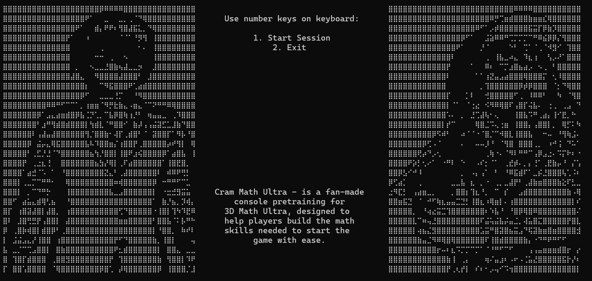

#
   _____                       __  __       _   _       _    _ _ _             
  / ____|                     |  \/  |     | | | |     | |  | | | |            
 | |     _ __ __ _ _ __ ___   | \  / | __ _| |_| |__   | |  | | | |_ _ __ __ _ 
 | |    | '__/ _` | '_ ` _ \  | |\/| |/ _` | __| '_ \  | |  | | | __| '__/ _` |
 | |____| | | (_| | | | | | | | |  | | (_| | |_| | | | | |__| | | |_| | | (_| |
  \_____|_|  \__,_|_| |_| |_| |_|  |_|\__,_|\__|_| |_|  \____/|_|\__|_|  \__,_|
                                                                               

Cram Math Ultra is a fan-made console pretraining tool for 3D Math Ultra, designed to help players improve their math speed and accuracy before jumping into the main game.

The project focuses on:
- Fast-paced math practice
- Difficulty progression
- Console-based gameplay
- Lightweight training sessions

---

## Features

- Multiple difficulty levels
- Different gameplay modes
- Dynamic math generation
- ASCII-based console UI
- Quick training sessions
- Score tracking

---

## Screenshots

### Main Menu



---

### Gameplay


---

### Results Screen


---

## Technologies

- .NET
- C#
- Console Rendering
- Async Audio
- State-Based UI System

---

## Getting Started

Clone the repository:

```bash
git clone <repository-url>
```

Run the project:

```bash
dotnet run
```

---

## Disclaimer

Cram Math Ultra is a fan project and is not affiliated with the creators of 3D Math Ultra.
